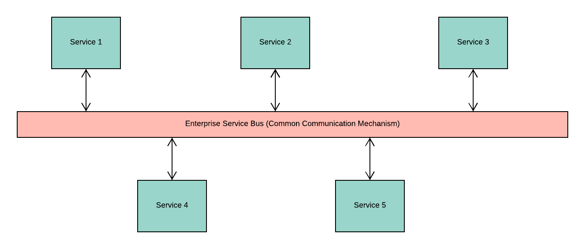
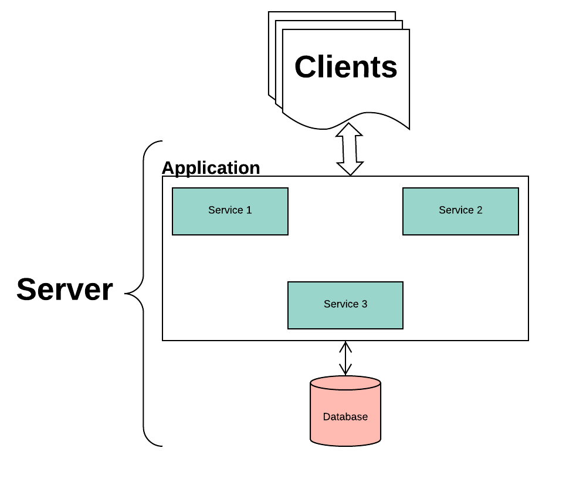
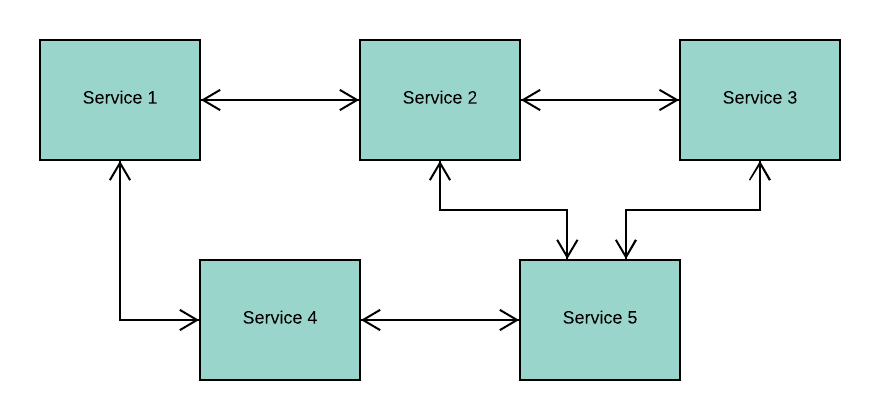

# Rise of Microservices and Docker

Are you a software engineer/developer/coder or may be even a tech enthusiast who has been hearing of terms like `Microservices` and `Docker` but still clueless as to why there is so much hype around it?

If yes, then you are at the right place. This is a must read blog for you!

## A little bit of "History"

In the early 2000's, we witnessed the rise of `Service Oriented Architecture (SOA)`, a popular design paradigm for building softwares. In simple words, SOA is an software architecture pattern that allows us to build large scale enterprise applications that normally require us to integrate multiple services, each of which is build over different platforms and languages through a common communication mechanism.

Here is a simple pictorial representation of the Service Oriented Architecture (SOA):

> Key Points

1. SOA is preferred for large scale software products such as big enterprise applications
2. SOA focuses on integrating multiple services in a single application rather than emphasizing on modularizing the application
3. The common communication mechanism used for interaction between multiple services in an SOA is referred as the [Enterprise Service Bus (ESB)](https://en.wikipedia.org/wiki/Enterprise_service_bus)
4. SOA based applications could be `monolithic` in nature. This means that you have single application layer which contains your user interface or presentation layer, business logic or application layer and database layer all integrated in a single platform

##  Interesting, tell me more about "Monolithic Architecture"

Let us understand monolithic applications by taking an example of an ecommerce website. Now, we all know that most of the ecommerce application can be accessed by multiple devices and hence they have multiple user interfaces for laptop and mobile views. This forms your presentation layer. 

We also know that there are multiple operations or services that are running in accordance to each other to ensure the regular functioning of your ecommerce applications. Some of these services are account creation, displaying product catalog, building and validating your shopping cart, generating bill, order confirmation, payment mechanism and so on. 

In a monolithic application, all these services run under a single application layer, so your ecommerce software architecture would look something similar to what is represented below:

> Drawbacks

1. It is obvious that the application is going to grow in size with the increase in number of services offered by it. This might become overwhelming for both new and existing developers to build and maintain the application codebase
2. We all know that technologies are continuously evolving. With a monolithic architecture, it would become tremendously difficult to not just incrementally update to latest versions of chosen technologies but also upgrading to newer technologies
3. Continuous deployments could become nightmares. Every small change in the application would require the developers to rebuild the whole application. This can increase the risk of failures and turn out to be time and resource consuming factor
4. With the increase in the customer base, we might have more requests to process and we will definitely require more resources for it. Thus, it is very important to build products that can scale. With monolithic applications, we can scale only in one direction, i.e., vertically but not horizontally. This means that we can scale the application over a single machine by adding more hardware resources such as memory and computational power but it is still going to be a challenge to ensure horizontal scaling, that which is spread across multiple machines

## "Microservices" to the rescue!

`Microservices` architecture can be considered to be a specialisation of SOA and an alternative pattern that overcomes the drawbacks of monolithic architecture. 

In this architecture, we focus on modularizing the application by dividing it into smaller standalone services that can be built, deployed, scaled and even maintained independently of other existing services or the application itself as a whole. These independent services are what is called as microservices and hence the name, Microservices Architecture.

> Highlights

1. Microservices Architecture and SOA are not the same but they do hold some similarities and hence Microservices Architecture is often referred as a variant of SOA or a fine-grained SOA or even a specialisation of SOA. In other words, SOA can be considered to be a superset of Microservices Architecture
2. The main reason as to why people find similarity between these architectures is because both of them focus on building loosely coupled services for an application. These services have clear boundaries and separate well-defined functionalities set for each one of them
3. The difference lies in the fact that SOA can mean a lot of other things. For instance, SOA can be applicable over a Monolithic Architecture as well where the focus is to integrate systems together in an application and ensure code resuablity. This does not hold true for Microservices Architecture, where the focus is to modularize the application by building independent services and ensuring scalabity of the product

> Advantages

1. Introduces the philosophy of `Separation of Concerns` and ensures `Agile Development` of software applications in both simple and complex domains
2. The standalone ability or indepedent nature of microservices open doors for following benefits:
   - Reduces complexity by allowing developers to break into small teams each of them building and maintaining one or more services
   - Reduces risk by allowing deployment in chunks rather than rebuilding the whole application for every small or big change
   - Easy maintainence by allowing flexibility to incrementally update/upgrade the technology stack for one or more services rather than the whole application in single point in time
   - In addition to giving you flexibility to build services in any language, thereby making it language independent, it also allows you to maintain separate data models of each of the given services
3. You can build a fully automated deployment mechanism for ensuring individual service deployments, service management and autoscaling of the application

## Evolution of Technologies

Alongside, evolution of software architectural patterns, we have also seen emergence of some new technologies such as `Docker` and `Kubernetes` for supporting our software infrastructures and ensuring efficient management of our scalable products and services. We have evolved from using `hardware virtualization` to `containerization`. 

Wait, you might be thinking, what does this even mean?

Now, in order to understand how we have evolved in the IT infrastructure space, let us take the help of the following diagram:

The first picture shows a physical machine or a hardware server. Normally, when we build applications, we use the resources provided by our host OS and the same pattern used to be followed for deploying the application. But what if you want to scale the application? At some point, you might want another hardware server and as the number keeps increasing, so does your cost and other resources like hardware and energy consumptions.

Also, you might be thinking if you really require all the resources of your hardware and host OS at the same time for running your application. Not really, so then why such a heavy infrastructure setup?

This led to the evolution of hardware virtualization for optimizing IT infrastructure setups through what we call today as Virtual Machines (VMs). As you see in the second diagram, VMs have their own guest OS which is run over a single physical machine or host OS. This enables us to run multiple applications without having the need for installing multiple physical machines. The host OS can ensure that there is systematic resource distribution and load balancing between the different VMs running on it.

Although, VMs made things easier to maintain and drastically reduced costs, there were still some more optimizations required. For instance, not all applications would behaviour as expected in an guest OS enviroment. Also, the guest OS would require a lot of resources for even running simple processes. 

These problems, led to our next innovation which is containerization. Unlike virtual machines which was more operating system specific, containers are application specific which makes it more lighter. Furthermore, VMs can run multiple processes whereas a container runs as a single process. This leds us to two things:
1. You can run multiple containers on a physical machine or you can even think of running it on a single VM. Either cases, it solves your application related problems
2. Containerization is not a competition to Virtualization but rather a complimentary factor to further optimise our IT software infrastructure

## Docker

Now that we understand the evolution of IT software infrastructure, we might want to know how can we achieve things like `Microservices Architecture` and `Containerization` that we discussed earlier? A simple answer to this could be, `Docker`.

[Docker](https://www.docker.com/) is the world's leading software containerization platform. It basically encapsulates your microservice into what we call as `Docker container` which can then be independently maintained and deployed. Each of these containers will be responsible for one specific business functionality.

In order to understand Docker in a little more depth, let us take the same example of an ecommerce website that we discussed earlier. We know that it will have multiple operations and services such as account creation, displaying product catalog, building and validation shopping cart and so on. In a microservice architecture, all these can be treated as microservices and encapsulated in a Docker container. But why would you do that?

One of the reasons would be to ensure consistency between development and production environment. For instance, consider that there are three developers working on this application. Each of them having their own environments. So one developer might be running `Windows` OS on his machine, while the second developer could be running `Mac` OS and the third developer would prefer a `Linux` based OS. Each of them would take hours of efforts to install the application in their respective development environments and an additional set of efforts to later deploy the same application on the cloud. This is definitely not smooth and there is a lot of friction to port such applications to cloud infrastructure.

With Docker, you can make your application independent of the host environment. Since you have microservices architecture, you can now encapsulate each of them in Docker containers. Docker containers are light weight, resource isolated environments through which you can build, maintain, ship and deploy your applcation.

> Advantages

1. Docker is a popular evolving software with an excellent community support and built for microservices
2. It is light weight when compared to VMs making it cost and resource effective
3. It provides uniformity across development and production environments making it a suitable fit for building cloud native applications
4. It provides facilities for continuous integration and deployment
5. Docker is not going anywhere, it provides integration with popular tools and services such as AWS, Microsoft Azure, Ansible, Kubernetes, Istio and lot more

## Conclusion

Now that we understand the reasons for all the hype around microservices and docker, our next blog will take you on a deeper dive to how you can use these technologies and build modern scalable applications with it.